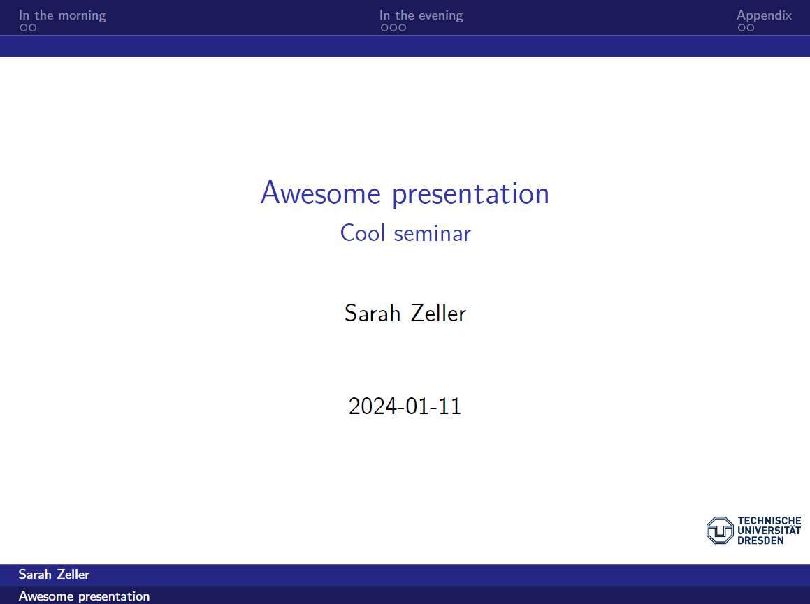

# tud-beamer

A template for a beamer presentation in quarto, styled for the TUD.



## Installing

```bash
quarto use template sarahzeller/tud-beamer
```

This will install the extension and create an example qmd file that you can use as a starting place for your presentation: `template.qmd`.

## Using 

Refer to `template.qmd` for how to use the extension.
For further information on beamer options, please refer to the [quarto](https://quarto.org/docs/reference/formats/presentations/beamer.html) website.

## References

If you're using *references*, please use a header at the second level (`## References`).
As in the template, please add the following lines then to place the references exactly there.
Otherwise, the references by default show up at the last slide.

Please write in the YAML header which references you want to use, like so:

```
bibliography: references.bib
```

```
::: {#refs}
:::
```
